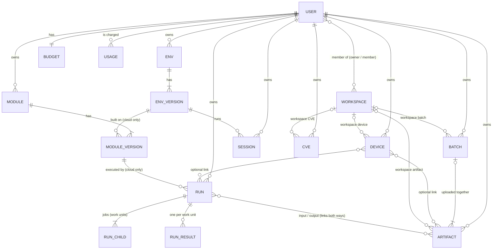

# Database

The platform stores its records in two DynamoDB tables. The sample model for both is [nosql-workbench-model.json](nosql-workbench-model.json).

| Table | Keys | Holds |
|---|---|---|
| `healthcare-iot-testbed-dev-users` | `userId` | One row per Cognito user: `email`, `fullName`, `role` (`admin` / `user`), `status`, timestamps. Written by the post-confirmation Lambda. |
| `healthcare-iot-testbed-dev-metadata` | `pk` + `sk` | Everything else, in a single-table design: devices, artifacts, upload batches, scripts (modules), environments, runs, sessions, workspaces and their members, CVE records, ownership links, budgets and the usage ledger. |

The metadata table is single-table so that one `Query` on a partition returns a record and everything hanging off it: a run with its children, results and outputs, or a user with everything they own. The table has no secondary indexes. Every access pattern below is a `GetItem`, or a `Query` on `pk` with an optional `begins_with` on `sk`.

**Opening the model:** in NoSQL Workbench, choose *Data modeler → Import data model* and pick `nosql-workbench-model.json`. The metadata table has one **facet** per entity (Device, Artifact, ModuleVersion, …). Open a facet to see only that entity's rows, with readable key names, or use the *Visualizer* aggregate view to see the whole sample dataset.

## Key conventions

- **Prefixed ids.** Keys are `TYPE#id`, for example `DEVICE#dev-001`, `ARTIFACT#art-004` or `RUN#run-001`. The prefix says what kind of record the key points to.
- **Time-ordered ids.** Artifact and upload-batch ids are UUIDv7, so their link rows sort by creation time and `ScanIndexForward = false` lists newest first. The sample data uses short readable ids instead.
- **Base record.** Every entity's own record is `pk = TYPE#id`, `sk = METADATA`. The other rows in that partition are children or links.
- **Versions.** `VERSION#0001`, `VERSION#0002`, … are zero-padded so that they sort in order. Version numbers elsewhere (`moduleVersion`, `envVersion`, `latestVersion`) are plain numbers.
- **`entity`.** Every row has an `entity` attribute naming its kind (`device`, `run-child`, `user-artifact`, …). Use it to tell rows apart when a query returns a mixed partition.
- **Two-way links.** A relationship is written as two rows, one in each partition, so that it can be queried from either side. Both rows are written in the same `TransactWriteItems` call. The row in the `USER#` / `DEVICE#` / `BATCH#` partition repeats a few **immutable** display fields (`name`, `type`, `createdAt`). Anything that changes, such as `status`, is only stored on the base record: list endpoints query the link rows, then read the base records with `BatchGetItem`, so status is never stale.
- **Ownership.** Every personal device and personal CVE, and every artifact, upload batch, module, environment, run and session, has `USER#{uid} / X#{id}` and `X#{id} / USER#{uid}` rows with `role = owner`. Their `entity` values are `user-x` / `x-user` (`user-device` / `device-user`, `user-artifact` / `artifact-user`, and likewise `batch`, `module`, `env`, `run`, `session`, `cve`). `owner` is currently the only role. The ownership check is a single `GetItem(USER#{uid}, X#{id})`.
- **Money.** Costs, holds and limits are DynamoDB numbers (`N`, exact decimals; boto3 `Decimal`) in USD, so they can be added atomically and compared in conditions.
- **Timestamps.** ISO-8601 UTC strings.

## Entities

### Device: `DEVICE#{id}` / `METADATA`

A physical device under test.

| Attribute | Type | Meaning |
|---|---|---|
| `name` | S | Display name |
| `type` | S | Device category, e.g. `blood-pressure` |
| `status` | S | `active` |
| `reverseEngineeringStatus` | S | `not_started` / `in_progress` / `complete`. Set with `PATCH /devices/{id}` (`update-device`) by the owner of a personal device, or by any member of a workspace device's workspace. Separate from `status`. Devices created before it existed have no attribute and read as `not_started`. Only stored here, not on the link rows; `GET /devices` reads it with `BatchGetItem`. |
| `dataPath` | S | S3 prefix for the device's files |
| `deviceId` | S | **Workspace devices only.** The device id |
| `workspaceId` | S | **Workspace devices only.** The workspace the device belongs to. Authoritative for access (see below). Set at creation and never changed. |
| `createdBy` | S | **Workspace devices only.** The member who created it (provenance, not ownership) |
| `createdAt`, `updatedAt` | S | Timestamps |

A device is either **personal** or belongs to exactly one **workspace**, decided only by whether its `METADATA` has a `workspaceId`:

| | Personal device (no `workspaceId`) | Workspace device (`workspaceId` set) |
|---|---|---|
| Created by | `POST /devices` `{name, type}` | `POST /devices` `{name, type, workspaceId}`, by any member or owner of the workspace |
| Links | `USER#{uid} / DEVICE#{did}` (`user-device`, `role = owner`, `name`) and `DEVICE#{did} / USER#{uid}` (`device-user`) | `WORKSPACE#{wid} / DEVICE#{did}` (`workspace-device`: `name`, `createdBy`, `createdAt`) and `DEVICE#{did} / WORKSPACE#{wid}` (`device-workspace`: `createdAt`). **No** ownership links. |
| Listed by | `GET /devices` | `GET /devices?workspaceId={wid}` (members only) |
| Who may use it | The owner, through the `USER#/DEVICE#` link (unchanged) | Every member of the workspace (`owner` or `member`), and nobody else |

- **`workspaceId` on `METADATA` is the authority.** The shared layer (`testbed_authz.require_resource`) reads `METADATA` first: with a `workspaceId` it checks only the caller's `USER#{uid} / WORKSPACE#{wid}` membership. It never falls back to `USER#/DEVICE#` links, so a leftover owner link grants nothing.
- **The workspace/device rows are for listing only.** `GET /devices?workspaceId=` queries `WORKSPACE#{wid}`, then lists a device only if its `METADATA` has that `workspaceId`; a link row alone never makes a device part of a workspace. `GET /devices` (personal) leaves out any device whose `METADATA` has a `workspaceId`.
- A workspace device's `METADATA`, both links, and `ConditionCheck`s that the workspace exists and the caller is still a member are written in one transaction.
- **Existing devices are personal.** Nothing adds a `workspaceId` to them; moving a device into a workspace will be a separate, explicit operation.
- **Artifacts and firmware** follow the device's scope: see [Artifact scope](#artifact-scope). The old `/devices/{id}/firmware` routes and runs still refuse workspace devices.

### Artifact: `ARTIFACT#{id}` / `METADATA`

Any stored file: uploaded firmware, pcaps, logs and binaries, plus every file a run produces.

| Attribute | Type | Meaning |
|---|---|---|
| `name` | S | Display name (defaults to the file name) |
| `type` | S | What the file is: `firmware` / `pcap` / `log` / `binary` / `other`. A run's output uses the same types, so an output pcap matches `type = pcap` queries. |
| `origin` | S | `upload` (sent from the web app) / `run` (written by a run) |
| `version` | S | Firmware version; required when `type = firmware`, not allowed otherwise |
| `sha256` | S | Full-file SHA-256, declared by the uploader. Only a verified hash is trusted, e.g. as a run-result key. |
| `sizeBytes` | N | Size in bytes (up to 5 GiB) |
| `originalFilename` | S | Name as uploaded, including the folder path for folder uploads |
| `s3Bucket`, `s3Key` | S | Object location: `artifacts/{artifactId}/{attemptId}` |
| `attemptId` | S | Current upload attempt. Every complete and retry is conditional on it. |
| `uploadMode` | S | `single` (presigned POST, up to 25 MiB) / `multipart` |
| `uploadId`, `partSize`, `partCount` | S, N, N | Multipart only: the S3 upload id and part layout (parts of at least 16 MiB, at most 1000 parts) |
| `uploadBatchId` | S | Upload batch the file was sent in |
| `deviceIds` | SS | Linked devices (copy of the link rows, for display) |
| `status` | S | See lifecycle below |
| `reverseEngineeringStatus` | S | **Firmware only.** Reverse-engineering progress: `not_started` / `in_progress` / `complete`, separate from the upload `status`. Written as `not_started` whenever a firmware artifact is created (upload, run output, migration). Set with `PATCH /artifacts/{id}` (`artifacts-update`), which rejects other types, by the owner of a personal artifact or any member of a workspace artifact's workspace. Firmware stored before it existed has no attribute and is returned as `not_started`; other types never have it and their API responses leave it out. Independent of the device's `reverseEngineeringStatus`. |
| `statusReason` | S | Why the upload failed |
| `statusUpdatedAt` | S | Time of the last status change |
| `tags` | SS | Free-form labels, used in run input queries |
| `derivedFromRun` | S | For `origin = run`: the run that produced the file |
| `derivedFromArtifacts` | SS | For `origin = run`: the input artifact ids |
| `migratedFromFirmwareId` | S | Set on records copied from the old `FIRMWARE#` rows |
| `workspaceId` | S | **Workspace artifacts only.** The workspace the artifact belongs to. Authoritative for access (see [Artifact scope](#artifact-scope)). Set at creation and never changed. |
| `createdBy`, `createdAt`, `updatedAt`, `uploadedAt` | S | Author and timestamps. On a workspace artifact `createdBy` is provenance only, never ownership. |

Lifecycle:
- **Single:** `pending` (upload URL issued) → `ready`. S3 checks the bytes against the declared SHA-256 as they are written, and complete confirms the stored checksum.
- **Multipart:** `pending` → `verifying` (parts assembled; S3 only checks SHA-256 per part) → `ready`, once `artifacts-verify` has streamed the object and checked the full SHA-256.
- Either can end in `failed`. A `pending` or `failed` upload can be retried, which starts a new `attemptId` and S3 key.
- The S3 object is tagged `upload-state=pending` until it is `ready`. A lifecycle rule deletes pending objects after 7 days, which removes superseded attempts and abandoned uploads.

Device links are **optional**, and an artifact can link to several devices (only devices the uploader may use, all of one scope; see below):
- `DEVICE#{did} / ARTIFACT#{type}#{id}` (`device-artifact`): `name`, `type`. The type is in the sort key, so "this device's firmware" is a single `begins_with`.
- `ARTIFACT#{id} / DEVICE#{did}` (`artifact-device`): `name` of the device.

**Firmware version guard:** `DEVICE#{did} / FWVER#{version}` (`device-firmware-version`): `artifactId`, `version`. Written in the same transaction as the artifact, one per linked device, with `attribute_not_exists`, so a firmware version is unique per device (whoever in a workspace uploads it).

#### Artifact scope

An artifact is **personal** or belongs to exactly one **workspace**, decided only by whether its `METADATA` has a `workspaceId`. `POST /artifacts/presign` takes the scope from the request's `deviceIds`; there is no `workspaceId` request field.

| Linked devices | Artifact scope |
|---|---|
| None, or only personal devices the caller owns | Personal, exactly as before |
| Only devices of one workspace the caller is a member of | That workspace |
| Personal and workspace devices, or devices of two workspaces | Rejected (400) before anything is written |

Each device is authorized by its own scope with `testbed_authz.require_resource`; a device the caller can't use is refused with 403.

| | Personal artifact | Workspace artifact |
|---|---|---|
| Links | `USER#{uid} / ARTIFACT#{aid}` (`user-artifact`, `role = owner`) and `ARTIFACT#{aid} / USER#{uid}` (`artifact-user`) | `WORKSPACE#{wid} / ARTIFACT#{aid}` (`workspace-artifact`: `name`, `type`, `createdBy`, `createdAt`) and `ARTIFACT#{aid} / WORKSPACE#{wid}` (`artifact-workspace`: `createdAt`). **No** ownership links. |
| Device, batch and firmware rows | Unchanged | The same `device-artifact` / `artifact-device` links, `batch-artifact` row and `FWVER#` guards |
| Who may read, download, complete, retry, get part URLs and set `reverseEngineeringStatus` | The owner (reads accept any `USER#/ARTIFACT#` link, as before) | Any member (`owner` or `member`) of the workspace, and nobody else |
| Listed by | `GET /artifacts` | `GET /artifacts?workspaceId={wid}` (members only), and the device and batch listings below |

- **Once an artifact's `METADATA` has a `workspaceId`, workspace membership is authoritative**: `USER#/ARTIFACT#` links, even an old owner row, grant nothing, and there is no fallback to them.
- **Link rows only find candidates.** Every listing has a scope (Personal, a workspace, a device's or a batch's), and returns an artifact only if the `workspaceId` on its `METADATA` matches it. So `WORKSPACE#`, `DEVICE#`, `BATCH#` or `USER#` rows alone never expose an artifact of another scope: `GET /artifacts` (Personal) leaves out workspace artifacts, a workspace listing leaves out personal and other workspaces' artifacts, and `GET /devices/{did}/artifacts` returns only artifacts of the device's own scope.
- A workspace artifact's rows are written in one transaction with a `ConditionCheck` that the caller is still a member.
- **Firmware** is an ordinary `type = firmware` artifact in either scope: version required, `FWVER#` guard per device, `reverseEngineeringStatus`, same upload lifecycle.
- **Device-less workspace artifacts** (e.g. a pcap not tied to a device) aren't possible yet: an upload with no devices is personal. Adding them later needs an explicit `workspaceId` on the request.
- **Runs** aren't workspace-aware yet: `runs-api` never uses a workspace artifact as an input (even one the caller uploaded), and workspace devices and batches can't be input sources. Run outputs stay personal.

### Upload batch: `BATCH#{id}` / `METADATA`

The files sent together in one upload from the web app. A run can use a batch as its input set.

| Attribute | Type | Meaning |
|---|---|---|
| `fileCount`, `totalBytes` | N | Files registered in the batch and their total size |
| `workspaceId` | S | **Workspace batches only.** Set when the batch's uploads are workspace artifacts |
| `createdBy`, `createdAt`, `updatedAt` | S | Author and timestamps |

- Members: `BATCH#{bid} / ARTIFACT#{aid}` (`batch-artifact`): `name`, `type`.
- Ownership (personal batch): `USER#{uid} / BATCH#{bid}` (`user-batch`) and `BATCH#{bid} / USER#{uid}` (`batch-user`).
- Workspace batch: `WORKSPACE#{wid} / BATCH#{bid}` (`workspace-batch`: `createdBy`, `createdAt`) and `BATCH#{bid} / WORKSPACE#{wid}` (`batch-workspace`), and no ownership links. A batch has its uploads' scope, and can only be reused (`uploadBatchId`) for uploads of the same scope (409 otherwise). Any member can add to it and list it (`GET /artifacts?batchId=`). `GET /artifacts/batches`, the run input picker, lists personal batches only.

### Module: `MODULE#{id}` / `METADATA`

A script the user uploads. Command-line tools reach a script through its environment (catalog tools) or an L3 Dockerfile; there is no separate "tool" module.

| | Meaning |
|---|---|
| **`runtime = cloud`** | Built into an image and run in bulk on AWS Batch |
| **`runtime = local`** | Stored and versioned only; runs on the user's machine. The cloud never builds or runs it. |

| Attribute | Type | Meaning |
|---|---|---|
| `name`, `description` | S | Display fields |
| `runtime` | S | `cloud` / `local` |
| `latestVersion` | N | Highest version number handed out |
| `latestReadyVersion` | N | Highest version that built successfully |
| `createdBy`, `createdAt`, `updatedAt` | S | Author and timestamps |

### Module version: `MODULE#{id}` / `VERSION#{n}`

`entity = module-version`.

| Attribute | Type | Cloud | Local | Meaning |
|---|---|---|---|---|
| `level` | S | ✓ | – | `L1` (`.py` with PEP 723), `L2` (`.zip` project), `L3` (`.zip` with Dockerfile) |
| `envId`, `envVersion`, `baseImage` | S, N, S | L1/L2 | – | Environment version the image is built `FROM` (default `platform-base`) |
| `command` | L | ✓ | – | What the launcher runs per work unit: the SDK driver for L1/L2, `platform.json`'s `command` for L3 |
| `sourceKey`, `sha256`, `sizeBytes`, `originalFilename` | S, S, N, S | ✓ | ✓ | The uploaded source (`scripts/{id}/{n}/{attempt}`) |
| `buildId` | S | ✓ | – | CodeBuild build id (links to the build log) |
| `imageUri` | S | ✓ | – | The built image, by digest (`repo@sha256:…`) |
| `jobDefinitionArn`, `heavyJobDefinitionArn` | S | ✓ | – | Batch job definitions for Fargate and, when enabled, EC2 |
| `freezeKey` | S | ✓ | – | S3 prefix of the `pip freeze` / `dpkg` lists |
| `status`, `statusReason`, `statusUpdatedAt` | S | ✓ | ✓ | See lifecycle below |
| `createdBy`, `createdAt` | S | ✓ | ✓ | Author and timestamp |

Lifecycle:
- **Cloud:** `pending` (upload URL issued) → `building` → `ready`. It can end in `rejected` (fails validation before the build, with the reason) or `build_failed`.
- **Local:** `pending` → `ready`.

### Environment: `ENV#{id}` / `METADATA`, and `ENV#{id}` / `VERSION#{n}`

A built container image with a set of tools. Scripts are built on top of it, and (step 3) sessions run on it. The base record (`entity = env`) has `name`, `description`, `base`, `latestVersion`, `latestReadyVersion`, `createdBy` and timestamps.

Two **platform environments** (`platform-base` and `platform-ghidra`) are published by the deploy-images workflow (`createdBy = platform`). They are listed under `PLATFORM / ENV#{id}` (`platform-env`), so every user can see them without an ownership row.

Each version (`entity = env-version`):

| Attribute | Type | Meaning |
|---|---|---|
| `baseImage` | S | Image this version is built `FROM` (a platform image or the parent version) |
| `catalogItems` | L | Catalog tools in the image, including those inherited from the parent |
| `parentVersion` / `basedOn` | N / S | The version it was built from |
| `packageMode` | S | `offline` (the only mode in v1) |
| `buildId`, `imageUri`, `freezeKey` | S | Same meaning as for module versions |
| `taskDefArn` | S | (Step 3) ECS task definition used to start sessions |
| `status`, `statusReason`, `statusUpdatedAt` | S | Same lifecycle as a cloud module version |
| `createdAt` | S | Timestamp |

### Run: `RUN#{id}` / `METADATA`

One cloud execution of a module version over a fixed set of input artifacts, run as an AWS Batch array job. The inputs are split into **work units**, one or more files each; the script runs once per unit.

| Attribute | Type | Meaning |
|---|---|---|
| `name` | S | Display name |
| `moduleId`, `moduleName`, `moduleVersion` | S, S, N | What is being run |
| `imageUri`, `jobDefinitionArn` | S | The image and job definition used |
| `inputs` | M | How the inputs were chosen (`batchId`, `deviceId`, `runId`, `artifactIds` count, or `type`/`tag`) |
| `mode`, `groupBy`, `chunkSize`, `unitsPerJob` | S, M, N, N | How files became units (`map` / `groupBy` / `chunk` / `all`) and units per job |
| `class`, `size`, `vcpu`, `memoryMiB`, `timeoutSec` | S, S, N, N, N | Capacity per job |
| `inputCount`, `unitCount`, `childCount` | N | Files, work units and Batch jobs |
| `maxCost`, `expectedCost`, `held` | N | Maximum (held against the budget), expected, and still held |
| `costProvisional`, `costActual` | N | From metering events / from the monthly true-up |
| `unitsSucceeded`, `unitsFailed`, `outputCount` | N | Progress counters, updated by the manifest service |
| `tokenHash` | S | SHA-256 of the per-run manifest token |
| `batchJobId` | S | The Batch (array) job |
| `cancelRequested`, `stopReason` | BOOL, S | Set by cancel, and by the watchdog when it stops the run |
| `status`, `statusReason`, `statusUpdatedAt` | S | See lifecycle below |
| `startedAt`, `endedAt`, `createdBy`, `createdAt`, `updatedAt` | S | Timestamps |

Lifecycle: `pending` → `queued` → `running` → `completed`, `failed`, `cancelled` (by the user) or `stopped` (by the watchdog: cost cap or budget). `completed` means every job ran; individual units can still have failed (`unitsFailed`).

Rows in the run's partition:
- `RUN#{id} / CHILD#{i:05}` (`run-child`): `units` (list of `{unitId, key, artifactIds}`), `status` (`queued` / `running` / `succeeded` / `failed`), `statusRank`, `attempts`, `logStreamName`, `startedAt`, `stoppedAt`, `statusReason`
- `RUN#{id} / RESULT#{unitId}` (`run-result`): `key`, `status` (`succeeded` / `failed`), `inputArtifactIds`, `outputArtifactIds`, `exitCode`, `error`. `unitId` is the SHA-256 of the unit's sorted input hashes, so identical units are only run once and a retried job skips finished units.
- `RUN#{id} / OUTCOUNT#{unitId}#{attempt}` (`run-output-count`): `files`, `bytes` registered so far, used to enforce the output caps
- `RUN#{id} / ARTIFACT#{aid}` (`run-artifact`) and `ARTIFACT#{aid} / RUN#{id}` (`artifact-run`): `relation` (`input` / `output`), so lineage can be followed both ways
- `RUN#{id} / DEVICE#{did}` (`run-device`) and `DEVICE#{did} / RUN#{id}` (`device-run`): when the inputs were chosen by device

Other run rows:
- `MODULE#{id} / RUN#{rid}` (`module-run`): `moduleVersion`, `status`, `class`, `size`, `childCount`, `unitCount`, `unitSeconds`. The run history per module; expected costs use seconds per unit from the last 20 runs.
- `ACTIVE#RUNS / RUN#{rid}` (`active-run`): `userId`. Written at start and deleted when the run settles; the watchdog reads only this partition.

Output artifacts are ordinary artifacts with `origin = run`, `derivedFromRun`, `derivedFromArtifacts` (the unit's inputs) and `runUnitId`, owned by the run's owner.

### Session: `SESSION#{id}` / `METADATA`

(Step 3.) An interactive JupyterLab session on Fargate. **Session** only ever means this; executions are runs.

| Attribute | Type | Meaning |
|---|---|---|
| `name` | S | Display name |
| `envId`, `envVersion` | S, N | Environment the session runs on |
| `packageMode` | S | Per-session override of the environment's mode |
| `taskArn`, `taskIp` | S | ECS task; the session proxy forwards traffic to `taskIp` |
| `tokenHash` | S | SHA-256 of the per-session manifest token |
| `status`, `statusReason`, `statusUpdatedAt` | S | `starting` → `running` → `stopping` → `stopped`, or `failed` |
| `startedAt`, `lastActivity`, `endedAt` | S | `lastActivity` drives the idle reaper |
| `cost` | N | Running cost total |
| `createdBy`, `createdAt`, `updatedAt` | S | Author and timestamps |

### Workspace: `WORKSPACE#{id}` / `METADATA`

A shared project. Its members will be able to use the workspace's resources (devices, artifacts, runs) once those become workspace-aware; for now it holds its members and invitations. Created with `POST /workspaces` (`workspaces-api`), which writes the record and the creator's two membership rows in one `TransactWriteItems`. The id is a UUIDv7.

| Attribute | Type | Meaning |
|---|---|---|
| `workspaceId` | S | Workspace id |
| `name` | S | Display name (1–100 characters, no control characters) |
| `createdBy`, `createdAt`, `updatedAt` | S | Author and timestamps |

Membership:
- `USER#{uid} / WORKSPACE#{wid}` (`user-workspace`): `role` (`owner` / `member`), `name` (the workspace name when the user joined), `joinedAt`. **This row is the membership:** the shared authorization layer (`testbed_authz`) reads only this row, and `GET /workspaces` lists the caller's workspaces from it, reading names from `METADATA`.
- `WORKSPACE#{wid} / USER#{uid}` (`workspace-user`): `role`, `email` (the member's verified Cognito email, lowercased, when available), `joinedAt`, `invitedBy` (absent for the creator). Used to list members; it never grants access on its own.

The creator is always `owner`; the role is set by the server, never by the request.

Invitations, addressed to a lowercased, trimmed email address. Whether the address has an account is never looked up. No email is sent; the invitee sees the invitation in the app.
- `WORKSPACE#{wid} / INVITE#{email}` (`workspace-invite`): `email`, `role` (always `member`), `invitedBy`, `invitedByEmail` (the owner's verified email, when available), `createdAt`, `expiresAt`. Owners see these in `GET /workspaces/{wid}`.
- `INVITEE#{email} / WORKSPACE#{wid}` (`invitee-workspace`): `workspaceName` (a copy; `GET /invites` shows the name from `METADATA`), `invitedBy`, `invitedByEmail`, `createdAt`, `expiresAt`. Lets the invitee find their invitations.
- Only an owner can invite (`POST /workspaces/{wid}/invites`). Both rows are written in one transaction, which re-checks the owner's role; an earlier invitation to the same address is only replaced once it has expired. At most 50 unexpired invitations per workspace.
- Invitations expire 14 days after `createdAt`. Expiry is checked when listing and accepting; expired rows stay until they are replaced or declined (there is no TTL).
- **Accept** (`POST /workspaces/{wid}/accept`) uses only the caller's verified token email: one transaction checks `METADATA` exists, deletes both invitation rows (the workspace row only if it is unexpired and unchanged since it was read) and puts both membership rows with `role = member`, `invitedBy` from the invitation and the invitee's email, each with `attribute_not_exists`. Accepting twice changes nothing.
- **Decline** (`POST /workspaces/{wid}/decline`) deletes both invitation rows in one transaction, for the caller's verified email only.
- Timestamps on these rows always include microseconds, so `expiresAt` compares correctly as a string in condition expressions.

### CVE: `CVE#{cveRecordId}` / `METADATA`

A known, public vulnerability (CVE) recorded against the devices under research, entered and managed in the web app with `cves-api` (`POST /cves`, `GET /cves`, `GET` / `PATCH /cves/{cveRecordId}`). A CVE is structured metadata, not a file: supporting PDFs, reports and logs stay artifacts.

**Two ids.** `cveRecordId` is the record's own id: a UUIDv7 generated by the server, used in keys and URLs. `cveId` is the public identifier (`CVE-2021-37584`). They are separate because the same public CVE can be recorded once in each scope (Personal, or each workspace), so `cveId` alone doesn't name a record.

| Attribute | Type | Meaning |
|---|---|---|
| `cveRecordId` | S | Record id (UUIDv7). Immutable |
| `cveId` | S | Public id in canonical form (see below). Immutable: to correct it, record the CVE again |
| `severity` | S | `low` / `medium` / `high` / `critical`. Required. Entered, not derived from the score (CVSS v2 and v3 band differently) |
| `cvssScore` | N | Optional. 0–10 inclusive, stored exactly as sent (`Decimal`, never a float; no rounding). Only a value DynamoDB can't store exactly (more than 38 significant digits) is refused |
| `cvssVersion` | S | Optional. `2.0` / `3.0` / `3.1` / `4.0` |
| `description` | S | Optional. Trimmed, at most 4000 characters, no control characters other than newline and tab |
| `affectedChipsets` | L | Optional. Up to 20 strings of at most 64 characters, trimmed, de-duplicated case-insensitively (the first spelling is kept). Free text: devices have no chipset attribute, so nothing is matched automatically |
| `references` | L | Optional. Up to 20 `http://` or `https://` URLs (at most 2048 characters each), so a stored reference can never become a `javascript:` link |
| `workspaceId` | S | **Workspace CVEs only.** Authoritative for access. Set at creation and never changed |
| `version` | N | 1 at creation, incremented by every `PATCH`, which is conditional on it (a concurrent edit gets 409) |
| `createdBy` | S | The caller's Cognito `sub` (never taken from the request). Provenance, not ownership |
| `createdAt`, `updatedAt` | S | Timestamps (with microseconds) |

Optional fields that are empty are left out rather than stored empty. `GET /cves` returns everything except `description` and `references`; `GET /cves/{cveRecordId}` returns everything.

**Canonical `cveId`.** Before validation and before the uniqueness claim: surrounding whitespace is trimmed, the Unicode hyphens U+2010–U+2015 and U+2212 (common in ids pasted from documents) become `-`, and letters are uppercased. The result must match `CVE-([0-9]{4})-([0-9]{4,19})` exactly, with ASCII digits only, and a year from 1999 to the current UTC year + 1. Only the canonical form is stored, so `cve-2021-37584` and `CVE–2021–37584` are the same id.

A CVE is **personal** or belongs to exactly one **workspace**, decided only by whether its `METADATA` has a `workspaceId`, exactly as for devices:

| | Personal CVE (no `workspaceId`) | Workspace CVE (`workspaceId` set) |
|---|---|---|
| Created by | `POST /cves` without `workspaceId` | `POST /cves` with `workspaceId`, by any member or owner of the workspace |
| Links | `USER#{uid} / CVE#{rid}` (`user-cve`: `role = owner`, `cveId`) and `CVE#{rid} / USER#{uid}` (`cve-user`: `role = owner`) | `WORKSPACE#{wid} / CVE#{rid}` (`workspace-cve`: `cveId`, `createdBy`, `createdAt`) and `CVE#{rid} / WORKSPACE#{wid}` (`cve-workspace`: `createdAt`). **No** ownership links |
| Uniqueness claim | `USER#{uid} / CVEID#{cveId}` | `WORKSPACE#{wid} / CVEID#{cveId}` |
| Listed by | `GET /cves` | `GET /cves?workspaceId={wid}` (members only) |
| Who may read and `PATCH` it | The owner, through a `USER#/CVE#` link with `role = owner` | Every member (`owner` or `member`) of the workspace, and nobody else |

- **Authorization** is `testbed_authz.require_resource(..., "CVE", cveRecordId)`: with a `workspaceId` only the caller's membership counts, and a leftover `USER#/CVE#` row grants nothing. A caller who may not use a CVE gets the same 404 as for one that doesn't exist.
- **Uniqueness claim** (`cve-claim`: `cveId`, `cveRecordId`, `createdAt`): one per canonical `cveId` per scope. It is written with `attribute_not_exists` in the same `TransactWriteItems` as the `METADATA` and both links, so a duplicate is refused atomically with 409, naming the existing `cveRecordId` (the caller already has access to that scope). The same `cveId` can be recorded in other scopes.
- **Creation** is one transaction: `METADATA`, both links and the claim, each with `attribute_not_exists`. For a workspace CVE, `ConditionCheck`s that `WORKSPACE#{wid} / METADATA` exists and the caller's membership role is still `owner` or `member` are added (also checked before the transaction).
- **`PATCH`** changes only `severity`, `cvssScore`, `cvssVersion`, `description`, `affectedChipsets` and `references` (null or empty clears an optional one). `cveRecordId`, `cveId`, `workspaceId`, `createdBy`, `createdAt`, `updatedAt`, `version` and `deviceIds` are refused with 400. It is one transaction: an `Update` of `METADATA` conditional on `attribute_exists(pk)` (a record deleted meanwhile is never recreated), the `version` read during authorization, and the scope (`workspaceId` unchanged, or still absent), plus a `ConditionCheck` that the caller is still a member, or still has the owner link.
- **Listings** query `USER#{uid}` or `WORKSPACE#{wid}` with `begins_with CVE#` (which never matches the `CVEID#` claim rows), then read the `METADATA` with `BatchGetItem`, keeping only those in the listing's scope: no `workspaceId` for Personal, exactly `{wid}` for a workspace. Link rows alone never expose a CVE of another scope. Newest first.
- **Not yet:** device links (`DEVICE#{did} / CVE#{rid}` and `CVE#{rid} / DEVICE#{did}`), deleting a CVE and `GET /devices/{deviceId}/cves` are Stage 3B.2. Firmware links are deferred. There is no way to move a CVE between scopes.

### Budget: `USER#{uid}` / `BUDGET`

Created with defaults (`DEFAULT_MONTHLY_LIMIT`, $25; Heavy off) the first time it's needed. Admins change it with `Platform/scripts/set_budget.py`.

| Attribute | Type | Meaning |
|---|---|---|
| `monthlyLimit` | N | Monthly spending limit (USD) |
| `period` | S | Month that `spentProvisional` belongs to (`2026-09`) |
| `spentProvisional` | N | Metered spend in `period` |
| `held` | N | Sum of the maximum costs of runs still going |
| `heavyEnabled` | BOOL | Whether the user can use the Heavy (EC2) class |
| `version` | N | Bumped by every write; holds are only written if it's unchanged since they were read |
| `updatedAt` | S | Timestamp |

A run starts only if `spentProvisional + held + maxCost <= monthlyLimit` (spend counts as 0 once `period` is a past month). The hold is written with `version = <read version>`, so two runs can't both claim the same remaining budget. Settlement and metering use atomic `ADD` (and bump `version`).

### Usage ledger: `USER#{uid}` / `USAGE#{period}#{source}#{resourceId}#{eventId}`

Append-only. `period` is the month the usage happened in, `source` is `batch`, `codebuild`, `ecs` (step 3) or `cur` (true-up), and `eventId` is the Batch job or CodeBuild build id. The key is deterministic and written with `attribute_not_exists(sk)`, so a redelivered event can't bill twice; the budget and run cost updates happen in the same transaction.

| Attribute | Type | Meaning |
|---|---|---|
| `kind` | S | `provisional` (from metering events) / `actual` (from the true-up) |
| `amount` | N | Cost in USD |
| `period`, `recordedAt` | S | Usage month and when it was recorded |
| `resource` | S | Human-readable description |
| `seconds` / `minutes` | N | Billed job seconds (all attempts, at least 60 each) / build minutes |
| `runId`, `jobId`, `buildId` | S | What was charged |
| `costTags` | M | Cost-allocation tags (`userId`, `runId`, …) |

## Relationships

- Every `owns` edge is a pair of ownership-link rows.
- `DEVICE` edges are optional. An artifact or run can have none, one or several.
- Local modules have versions, but nothing is built on them and no run executes them.

## Access patterns

| Need | Operation |
|---|---|
| User's devices / artifacts / batches / modules / envs / runs / sessions | `Query pk = USER#{uid}, sk begins_with DEVICE#` (or `ARTIFACT#`, `BATCH#`, `MODULE#`, `ENV#`, `RUN#`, `SESSION#`) |
| Ownership check before any read or write | `GetItem pk = USER#{uid}, sk = X#{id}` |
| Owners of a resource | `Query pk = X#{id}, sk begins_with USER#` |
| A device's firmware | `Query pk = DEVICE#{did}, sk begins_with ARTIFACT#firmware#` |
| Is this firmware version taken on the device? | `GetItem pk = DEVICE#{did}, sk = FWVER#{version}` |
| Files in an upload batch | `Query pk = BATCH#{bid}, sk begins_with ARTIFACT#` |
| All of a device's artifacts / runs | `Query pk = DEVICE#{did}, sk begins_with ARTIFACT#` / `RUN#` |
| A workspace's devices | `Query pk = WORKSPACE#{wid}, sk begins_with DEVICE#`, then `BatchGetItem` of `DEVICE#{did} / METADATA`, keeping those whose `workspaceId` is `{wid}` |
| May this user use this device? | `GetItem DEVICE#{did} / METADATA`; with a `workspaceId`, `GetItem USER#{uid} / WORKSPACE#{wid}`, otherwise `GetItem USER#{uid} / DEVICE#{did}` |
| Devices an artifact or run is linked to | `Query pk = ARTIFACT#{id}` (or `RUN#{id}`), `sk begins_with DEVICE#` |
| Artifact details | `GetItem pk = ARTIFACT#{id}, sk = METADATA` (many at once: `BatchGetItem`) |
| A workspace's artifacts | `Query pk = WORKSPACE#{wid}, sk begins_with ARTIFACT#`, then `BatchGetItem` of the `METADATA`, keeping those whose `workspaceId` is `{wid}` |
| May this user use this artifact? | `GetItem ARTIFACT#{aid} / METADATA`; with a `workspaceId`, `GetItem USER#{uid} / WORKSPACE#{wid}`, otherwise `GetItem USER#{uid} / ARTIFACT#{aid}` |
| Module and all its versions | `Query pk = MODULE#{id}`. Rows sort as `METADATA`, `RUN#…`, `VERSION#…`, so filter on `entity`, or use two queries (`sk = METADATA`, `sk begins_with VERSION#`) |
| Newest ready module version | `Query pk = MODULE#{id}, sk begins_with VERSION#`, `ScanIndexForward = false`, first `status = ready` |
| Module run history (for estimates) | `Query pk = MODULE#{id}, sk begins_with RUN#`, newest 20 |
| Environment versions | `Query pk = ENV#{id}, sk begins_with VERSION#` |
| Platform environments (visible to everyone) | `Query pk = PLATFORM, sk begins_with ENV#` |
| Everything about a run | `Query pk = RUN#{id}` |
| A run's jobs / outputs | `Query pk = RUN#{id}, sk begins_with CHILD#` / `ARTIFACT#` (filter `relation = output`) |
| Which runs used or produced this artifact | `Query pk = ARTIFACT#{aid}, sk begins_with RUN#` |
| Has this work unit already been done? | `GetItem pk = RUN#{id}, sk = RESULT#{unitId}` (many at once: `BatchGetItem`) |
| Runs in progress (watchdog) | `Query pk = ACTIVE#RUNS` |
| Session for the proxy | `GetItem pk = SESSION#{id}, sk = METADATA` |
| Budget check / hold | `GetItem` then `UpdateItem pk = USER#{uid}, sk = BUDGET` conditional on `version` |
| Usage for a month | `Query pk = USER#{uid}, sk begins_with USAGE#2026-09#` |
| Is this user a workspace member, and with which role? | `GetItem pk = USER#{uid}, sk = WORKSPACE#{wid}` |
| User's workspaces | `Query pk = USER#{uid}, sk begins_with WORKSPACE#`, then `BatchGetItem` of `WORKSPACE#{wid} / METADATA` |
| Workspace members | `Query pk = WORKSPACE#{wid}, sk begins_with USER#` |
| Workspace's pending invitations (owners) | `Query pk = WORKSPACE#{wid}, sk begins_with INVITE#`, unexpired only |
| Invitations addressed to me | `Query pk = INVITEE#{email}, sk begins_with WORKSPACE#`, unexpired only, then `BatchGetItem` of `WORKSPACE#{wid} / METADATA` |
| My invitation to this workspace | `GetItem pk = WORKSPACE#{wid}, sk = INVITE#{email}` |
| User's personal CVEs | `Query pk = USER#{uid}, sk begins_with CVE#`, then `BatchGetItem` of `CVE#{rid} / METADATA`, keeping those without a `workspaceId` |
| A workspace's CVEs | `Query pk = WORKSPACE#{wid}, sk begins_with CVE#`, then `BatchGetItem` of the `METADATA`, keeping those whose `workspaceId` is `{wid}` |
| May this user use this CVE? | `GetItem CVE#{rid} / METADATA`; with a `workspaceId`, `GetItem USER#{uid} / WORKSPACE#{wid}`, otherwise `GetItem USER#{uid} / CVE#{rid}` |
| Is this CVE already recorded in the scope? | `GetItem pk = USER#{uid}` (or `WORKSPACE#{wid}`), `sk = CVEID#{cveId}`; enforced by the claim's `attribute_not_exists` |

## Status tracking

Each status-bearing row stores its **current** status (`status`, `statusReason`, `statusUpdatedAt`) in DynamoDB. The UI reads status from these rows only, and never calls CodeBuild, Batch or ECS from the browser path.
- **Writers:** the event Lambdas (`builds-events`, `runs-events`, `usage-meter`, and the session Lambdas in step 3) triggered by EventBridge state-change events, plus `runs-manifest` for work-unit results. They use conditional updates, so an out-of-order or repeated event can't move a status backwards or apply twice.
- **What isn't stored:** build logs, job logs and package lists. These stay in CloudWatch Logs and S3, and the row only points to them (`buildId`, `logStreamName`, `freezeKey`). The UI fetches them when a user opens them.
- **No history table:** status history isn't kept. `statusUpdatedAt` is enough to spot stuck work, and the usage ledger records what was billed.

## Migration and future work

- **Firmware:** the old `/devices/{id}/firmware` routes only serve personal devices: they refuse a workspace device, even for a member or with a leftover `USER#/DEVICE#` row. The web app now uploads firmware as `ARTIFACT#` records (`type = firmware`) with device links and a `FWVER#` guard. The old firmware Lambdas (`presign-firmware`, `complete-firmware`, `list-firmware`) and their `DEVICE#{did} / FIRMWARE#{version}` rows are still deployed but no longer used by the UI. [`Platform/scripts/migrate_firmware_to_artifacts.py`](../scripts/migrate_firmware_to_artifacts.py) copies the old rows into artifacts (dry run by default, `--apply` to write; safe to re-run). The S3 objects stay where they are. Once it has run, the old Lambdas and routes can be removed. `FIRMWARE#` rows are deliberately left out of the model.
- **Old model:** `OUTPUT#`, `MODULE# / SCRIPT|TOOL` and the run-style `SESSION#` rows from the April model have been replaced by the entities above. Modules no longer have a `kind`: tools come from environments or L3 Dockerfiles.
- **Groups and sharing:** only `role = owner` is used today. A later user-groups system can add a `GROUP#{gid}` principal with the same two-way link shape (`GROUP#/X#` and `X#/GROUP#`) and more roles, without changing existing rows.
