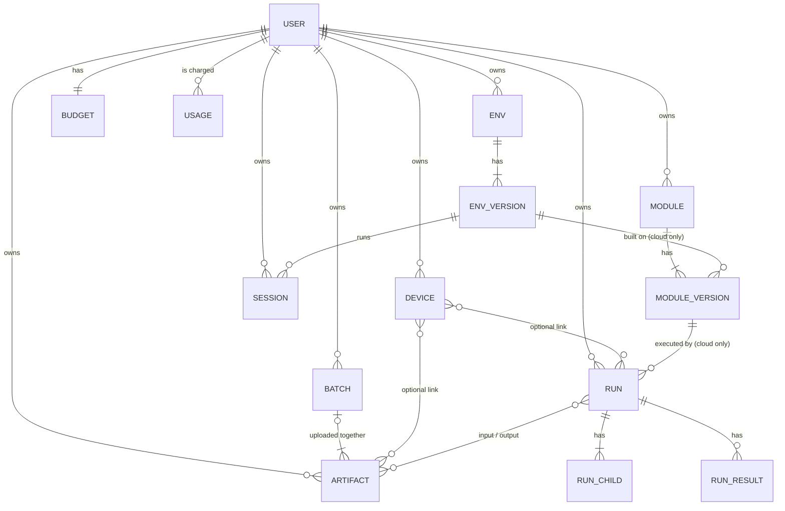

# Database

The platform stores its records in two DynamoDB tables. The sample model for both is [nosql-workbench-model.json](nosql-workbench-model.json).

| Table | Keys | Holds |
|---|---|---|
| `healthcare-iot-testbed-dev-users` | `userId` | One row per Cognito user: `email`, `fullName`, `role` (`admin` / `user`), `status`, timestamps. Written by the post-confirmation Lambda. |
| `healthcare-iot-testbed-dev-metadata` | `pk` + `sk` | Everything else, in a single-table design: devices, artifacts, upload batches, modules, environments, runs, sessions, ownership links, budgets and the usage ledger. |

The metadata table is single-table so that one `Query` on a partition returns a record and everything hanging off it: a run with its children, results and outputs, or a user with everything they own. The table has no secondary indexes. Every access pattern below is a `GetItem`, or a `Query` on `pk` with an optional `begins_with` on `sk`.

**Opening the model:** in NoSQL Workbench, choose *Data modeler → Import data model* and pick `nosql-workbench-model.json`. The metadata table has one **facet** per entity (Device, Artifact, ModuleVersion, …). Open a facet to see only that entity's rows, with readable key names, or use the *Visualizer* aggregate view to see the whole sample dataset.

## Key conventions

- **Prefixed ids.** Keys are `TYPE#id`, for example `DEVICE#dev-001`, `ARTIFACT#art-004` or `RUN#run-001`. The prefix says what kind of record the key points to.
- **Time-ordered ids.** Artifact and upload-batch ids are UUIDv7, so their link rows sort by creation time and `ScanIndexForward = false` lists newest first. The sample data uses short readable ids instead.
- **Base record.** Every entity's own record is `pk = TYPE#id`, `sk = METADATA`. The other rows in that partition are children or links.
- **Versions.** `VERSION#0001`, `VERSION#0002`, … are zero-padded so that they sort in order. Version numbers elsewhere (`moduleVersion`, `envVersion`, `latestVersion`) are plain numbers.
- **`entity`.** Every row has an `entity` attribute naming its kind (`device`, `run-child`, `user-artifact`, …). Use it to tell rows apart when a query returns a mixed partition.
- **Two-way links.** A relationship is written as two rows, one in each partition, so that it can be queried from either side. Both rows are written in the same `TransactWriteItems` call. The row in the `USER#` / `DEVICE#` / `BATCH#` partition repeats a few **immutable** display fields (`name`, `type`, `createdAt`). Anything that changes, such as `status`, is only stored on the base record: list endpoints query the link rows, then read the base records with `BatchGetItem`, so status is never stale.
- **Ownership.** Every device, artifact, upload batch, module, environment, run and session has `USER#{uid} / X#{id}` and `X#{id} / USER#{uid}` rows with `role = owner`. Their `entity` values are `user-x` / `x-user` (`user-device` / `device-user`, `user-artifact` / `artifact-user`, and likewise `batch`, `module`, `env`, `run`, `session`). `owner` is currently the only role. The ownership check is a single `GetItem(USER#{uid}, X#{id})`.
- **Money.** Costs, holds and limits are decimal strings (`"0.0134"`), in USD.
- **Timestamps.** ISO-8601 UTC strings.

## Entities

### Device: `DEVICE#{id}` / `METADATA`

A physical device under test.

| Attribute | Type | Meaning |
|---|---|---|
| `name` | S | Display name |
| `type` | S | Device category, e.g. `blood-pressure` |
| `status` | S | `active` |
| `dataPath` | S | S3 prefix for the device's files |
| `createdAt`, `updatedAt` | S | Timestamps |

### Artifact: `ARTIFACT#{id}` / `METADATA`

Any stored file: uploaded firmware, pcaps, logs and binaries, plus every file a run produces.

| Attribute | Type | Meaning |
|---|---|---|
| `name` | S | Display name (defaults to the file name) |
| `type` | S | What the file is: `firmware` / `pcap` / `log` / `binary` / `other`. A run's output uses the same types, so an output pcap matches `type = pcap` queries. |
| `origin` | S | `upload` (sent from the web app) / `run` (written by a run) |
| `version` | S | Firmware version; required when `type = firmware`, not allowed otherwise |
| `sha256` | S | Full-file SHA-256, declared by the uploader. Only a verified hash is trusted, e.g. as a run-result key. |
| `sizeBytes` | N | Size in bytes (up to 5 GiB) |
| `originalFilename` | S | Name as uploaded, including the folder path for folder uploads |
| `s3Bucket`, `s3Key` | S | Object location: `artifacts/{artifactId}/{attemptId}` |
| `attemptId` | S | Current upload attempt. Every complete and retry is conditional on it. |
| `uploadMode` | S | `single` (presigned POST, up to 25 MiB) / `multipart` |
| `uploadId`, `partSize`, `partCount` | S, N, N | Multipart only: the S3 upload id and part layout (parts of at least 16 MiB, at most 1000 parts) |
| `uploadBatchId` | S | Upload batch the file was sent in |
| `deviceIds` | SS | Linked devices (copy of the link rows, for display) |
| `status` | S | See lifecycle below |
| `statusReason` | S | Why the upload failed |
| `statusUpdatedAt` | S | Time of the last status change |
| `tags` | SS | Free-form labels, used in run input queries |
| `derivedFromRun` | S | For `origin = run`: the run that produced the file |
| `derivedFromArtifacts` | SS | For `origin = run`: the input artifact ids |
| `migratedFromFirmwareId` | S | Set on records copied from the old `FIRMWARE#` rows |
| `createdBy`, `createdAt`, `updatedAt`, `uploadedAt` | S | Author and timestamps |

Lifecycle:
- **Single:** `pending` (upload URL issued) → `ready`. S3 checks the bytes against the declared SHA-256 as they are written, and complete confirms the stored checksum.
- **Multipart:** `pending` → `verifying` (parts assembled; S3 only checks SHA-256 per part) → `ready`, once `artifacts-verify` has streamed the object and checked the full SHA-256.
- Either can end in `failed`. A `pending` or `failed` upload can be retried, which starts a new `attemptId` and S3 key.
- The S3 object is tagged `upload-state=pending` until it is `ready`. A lifecycle rule deletes pending objects after 7 days, which removes superseded attempts and abandoned uploads.

Device links are **optional**, and an artifact can link to several devices (only devices the uploader owns):
- `DEVICE#{did} / ARTIFACT#{type}#{id}` (`device-artifact`): `name`, `type`. The type is in the sort key, so "this device's firmware" is a single `begins_with`.
- `ARTIFACT#{id} / DEVICE#{did}` (`artifact-device`): `name` of the device.

**Firmware version guard:** `DEVICE#{did} / FWVER#{version}` (`device-firmware-version`): `artifactId`, `version`. Written in the same transaction as the artifact, one per linked device, with `attribute_not_exists`, so a firmware version is unique per device.

### Upload batch: `BATCH#{id}` / `METADATA`

The files sent together in one upload from the web app. A run can use a batch as its input set.

| Attribute | Type | Meaning |
|---|---|---|
| `fileCount`, `totalBytes` | N | Files registered in the batch and their total size |
| `createdBy`, `createdAt`, `updatedAt` | S | Author and timestamps |

- Members: `BATCH#{bid} / ARTIFACT#{aid}` (`batch-artifact`): `name`, `type`.
- Ownership: `USER#{uid} / BATCH#{bid}` (`user-batch`) and `BATCH#{bid} / USER#{uid}` (`batch-user`).

### Module: `MODULE#{id}` / `METADATA`

A script or tool the user uploads. Modules are classified by two independent tags:

| | `runtime = cloud` | `runtime = local` |
|---|---|---|
| **`kind = script`** (user-written code) | Built into an image and run in bulk on AWS Batch | Stored and versioned only; runs on the user's machine |
| **`kind = tool`** (prebuilt program with a fixed command) | Image plus `command`, run in bulk on AWS Batch | Stored and versioned only; runs on the user's machine |

The cloud never builds or runs local modules, and it doesn't record their executions.

| Attribute | Type | Meaning |
|---|---|---|
| `name`, `description` | S | Display fields |
| `kind` | S | `script` / `tool` |
| `runtime` | S | `cloud` / `local` |
| `latestVersion` | N | Highest version number |
| `createdBy`, `createdAt`, `updatedAt` | S | Author and timestamps |

### Module version: `MODULE#{id}` / `VERSION#{n}`

`entity = module-version`.

| Attribute | Type | Cloud | Local | Meaning |
|---|---|---|---|---|
| `level` | S | scripts | – | `L1` (`.py` with PEP 723), `L2` (`.zip` project), `L3` (`.zip` with Dockerfile) |
| `command` | S | tools | – | Fixed command line run inside the image |
| `envId`, `envVersion` | S, N | ✓ | – | Environment version the image is built on |
| `sourceKey` | S | ✓ | ✓ | S3 key of the uploaded source |
| `sha256` | S | ✓ | ✓ | Source hash |
| `sizeBytes`, `originalFilename` | N, S | – | ✓ | Upload details for download |
| `buildId` | S | ✓ | – | CodeBuild build id (links to build logs) |
| `imageDigest` | S | ✓ | – | ECR image digest the run uses |
| `freezeKey` | S | ✓ | – | S3 prefix of the `pip freeze` / `dpkg` lists |
| `status`, `statusReason`, `statusUpdatedAt` | S | ✓ | ✓ | See lifecycle below |
| `createdAt` | S | ✓ | ✓ | Timestamp |

Lifecycle:
- **Cloud:** `pending` → `uploaded` → `building` → `ready`. It can also end in `build_failed`, or in `rejected` (fails validation).
- **Local:** `pending` → `ready`.

### Environment: `ENV#{id}` / `METADATA`, and `ENV#{id}` / `VERSION#{n}`

A built container image. Interactive sessions run on it, and cloud modules are built on top of it. The base record (`entity = env`) has `name`, `description`, `latestVersion`, `createdBy` and timestamps. Each version (`entity = env-version`) has:

| Attribute | Type | Meaning |
|---|---|---|
| `baseImage` | S | Platform base image it starts from |
| `catalogItems` | SS | Catalog tools installed (e.g. `tshark`, `ghidra`) |
| `parentVersion` | N | Version this one was built `FROM`, when a package was added |
| `packageMode` | S | `offline` (the only mode in v1) |
| `buildId`, `imageDigest`, `freezeKey` | S | Same meaning as for module versions |
| `taskDefArn` | S | ECS task definition used to start sessions |
| `status`, `statusReason`, `statusUpdatedAt` | S | Same lifecycle as a cloud module version |
| `createdAt` | S | Timestamp |

### Run: `RUN#{id}` / `METADATA`

One cloud execution of a module version over a set of input artifacts, run as an AWS Batch array job.

| Attribute | Type | Meaning |
|---|---|---|
| `name` | S | Display name |
| `moduleId`, `moduleVersion` | S, N | What is being run |
| `query` | S | Input selection, resolved to artifacts at start |
| `mode` | S | `map` (one input per child) / `group` / `all` |
| `class` | S | `economy` / `standard` / `heavy` (Heavy is gated by the user's budget flag) |
| `size` | S | Size preset `S` / `M` / `L` / `XL` |
| `childCount` | N | Number of array children |
| `estimate`, `maxCost` | S | Expected and maximum cost |
| `held` | S | Amount currently held against the budget |
| `costProvisional`, `costActual` | S | From metering events / from the monthly CUR true-up |
| `tokenHash` | S | Hash of the per-run manifest-service token |
| `status`, `statusReason`, `statusUpdatedAt` | S | See lifecycle below |
| `startedAt`, `endedAt`, `createdBy`, `createdAt`, `updatedAt` | S | Timestamps |

Lifecycle: `pending` → `queued` → `running` → `completed`, `failed` or `cancelled`.

Rows in the run's partition:
- `RUN#{id} / CHILD#{i:05}` (`run-child`): `batchJobId`, `attempts`, `inputCount`, `status`, `statusReason`, `statusUpdatedAt`
- `RUN#{id} / RESULT#{inputSha}` (`run-result`): `inputArtifactId`, `outputArtifactIds`, `status`. The manifest service checks these rows so that a retried child skips inputs it has already done.
- `RUN#{id} / ARTIFACT#{aid}` (`run-artifact`): `relation` (`input` / `output`), `name`
- `RUN#{id} / DEVICE#{did}` (`run-device`) and `DEVICE#{did} / RUN#{id}` (`device-run`): optional device links

`MODULE#{id} / RUN#{rid}` (`module-run`) stores `moduleVersion`, `status` and `durationSec`. It gives the run history per module, which the expected-cost estimate uses.

### Session: `SESSION#{id}` / `METADATA`

An interactive JupyterLab session on Fargate. **Session** only ever means this; executions are runs.

| Attribute | Type | Meaning |
|---|---|---|
| `name` | S | Display name |
| `envId`, `envVersion` | S, N | Environment the session runs on |
| `packageMode` | S | Per-session override of the environment's mode |
| `taskArn`, `taskIp` | S | ECS task; the session proxy forwards traffic to `taskIp` |
| `status`, `statusReason`, `statusUpdatedAt` | S | `starting` → `running` → `stopping` → `stopped`, or `failed` |
| `startedAt`, `lastActivity`, `endedAt` | S | `lastActivity` drives the idle reaper |
| `cost` | S | Running cost total |
| `createdBy`, `createdAt`, `updatedAt` | S | Author and timestamps |

### Budget: `USER#{uid}` / `BUDGET`

| Attribute | Type | Meaning |
|---|---|---|
| `monthlyLimit` | S | Monthly spend limit |
| `held` | S | Sum of open run holds |
| `heavyEnabled` | BOOL | Whether the user can use the Heavy (EC2) class |
| `updatedAt` | S | Timestamp |

### Usage ledger: `USER#{uid}` / `USAGE#{ts}#{source}#{id}`

The ledger is append-only. `source` is `batch`, `ecs`, `codebuild` or `cur`, and `id` is the run, session or build.

| Attribute | Type | Meaning |
|---|---|---|
| `kind` | S | `provisional` (from metering events) / `actual` (from the CUR true-up) |
| `amount` | S | Cost |
| `resource` | S | Human-readable description |
| `costTags` | M | Cost-allocation tags (`userId`, `resourceId`, …) |

## Relationships

- Every `owns` edge is a pair of ownership-link rows.
- `DEVICE` edges are optional. An artifact or run can have none, one or several.
- Local modules have versions, but nothing is built on them and no run executes them.

## Access patterns

| Need | Operation |
|---|---|
| User's devices / artifacts / batches / modules / envs / runs / sessions | `Query pk = USER#{uid}, sk begins_with DEVICE#` (or `ARTIFACT#`, `BATCH#`, `MODULE#`, `ENV#`, `RUN#`, `SESSION#`) |
| Ownership check before any read or write | `GetItem pk = USER#{uid}, sk = X#{id}` |
| Owners of a resource | `Query pk = X#{id}, sk begins_with USER#` |
| A device's firmware | `Query pk = DEVICE#{did}, sk begins_with ARTIFACT#firmware#` |
| Is this firmware version taken on the device? | `GetItem pk = DEVICE#{did}, sk = FWVER#{version}` |
| Files in an upload batch | `Query pk = BATCH#{bid}, sk begins_with ARTIFACT#` |
| All of a device's artifacts / runs | `Query pk = DEVICE#{did}, sk begins_with ARTIFACT#` / `RUN#` |
| Devices an artifact or run is linked to | `Query pk = ARTIFACT#{id}` (or `RUN#{id}`), `sk begins_with DEVICE#` |
| Artifact details | `GetItem pk = ARTIFACT#{id}, sk = METADATA` (many at once: `BatchGetItem`) |
| Module and all its versions | `Query pk = MODULE#{id}`. Rows sort as `METADATA`, `RUN#…`, `VERSION#…`, so filter on `entity`, or use two queries (`sk = METADATA`, `sk begins_with VERSION#`) |
| Latest module version | `Query pk = MODULE#{id}, sk begins_with VERSION#`, `ScanIndexForward = false`, `Limit = 1` |
| Module run history (for estimates) | `Query pk = MODULE#{id}, sk begins_with RUN#` |
| Environment versions | `Query pk = ENV#{id}, sk begins_with VERSION#` |
| Everything about a run | `Query pk = RUN#{id}` |
| A run's children / outputs | `Query pk = RUN#{id}, sk begins_with CHILD#` / `ARTIFACT#` (filter `relation = output`) |
| Has this input already been processed? | `GetItem pk = RUN#{id}, sk = RESULT#{inputSha}` |
| Session for the proxy | `GetItem pk = SESSION#{id}, sk = METADATA` |
| Budget check / hold | `UpdateItem pk = USER#{uid}, sk = BUDGET` with a condition expression |
| Usage for a month | `Query pk = USER#{uid}, sk between USAGE#2026-09 and USAGE#2026-09~` |

## Status tracking

Each status-bearing row stores its **current** status (`status`, `statusReason`, `statusUpdatedAt`) in DynamoDB. The UI reads status from these rows only, and never calls CodeBuild, Batch or ECS from the browser path.
- **Writers:** the event Lambdas (`scripts-build-events`, `runs-events`, session Lambdas) triggered by EventBridge state-change events. They use conditional updates, so an out-of-order event can't move a status backwards.
- **What isn't stored:** build logs, job logs and package lists. These stay in CloudWatch Logs and S3, and the row only points to them (`buildId`, `batchJobId`, `freezeKey`). The UI fetches them when a user opens them.
- **No history table:** status history isn't kept. `statusUpdatedAt` is enough to spot stuck work, and the usage ledger records what was billed.

## Migration and future work

- **Firmware:** the web app now uploads firmware as `ARTIFACT#` records (`type = firmware`) with device links and a `FWVER#` guard. The old firmware Lambdas (`presign-firmware`, `complete-firmware`, `list-firmware`) and their `DEVICE#{did} / FIRMWARE#{version}` rows are still deployed but no longer used by the UI. [`Platform/scripts/migrate_firmware_to_artifacts.py`](../scripts/migrate_firmware_to_artifacts.py) copies the old rows into artifacts (dry run by default, `--apply` to write; safe to re-run). The S3 objects stay where they are. Once it has run, the old Lambdas and routes can be removed. `FIRMWARE#` rows are deliberately left out of the model.
- **Old model:** `OUTPUT#`, `MODULE# / SCRIPT|TOOL` and the run-style `SESSION#` rows from the April model have been replaced by the entities above.
- **Groups and sharing:** only `role = owner` is used today. A later user-groups system can add a `GROUP#{gid}` principal with the same two-way link shape (`GROUP#/X#` and `X#/GROUP#`) and more roles, without changing existing rows.
